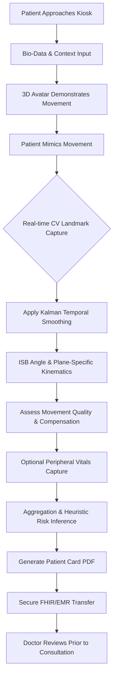
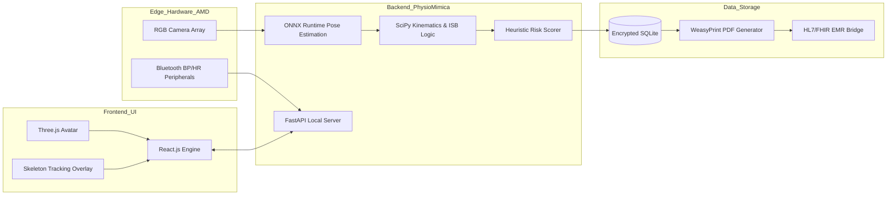

# QUEUEZERO™ — Primary Waiting Diagnosis System

## 1. System Overview

Powered by the internal **PhysioMimica Engine**, **QUEUEZERO™** is an intelligent, offline-first pre-assessment kiosk designed to convert clinic waiting time into meaningful primary clinical screening. Built for large clinic displays and powered by advanced AMD edge compute modules, the system securely evaluates full-body musculoskeletal ranges of motion (ROM), movement quality, and patient bio-data in the waiting room.

Crucially, QUEUEZERO™ is an assistive technology, designed to provide probabilistic, screening-level insights to clinicians with validated biomechanical data, strictly avoiding diagnostic overclaims or definitive disease labeling.

---

## 2. Step-by-Step Patient Flow

QUEUEZERO™ is completely self-guided, transforming the waiting room experience:

1. **Initiation & Context**: The patient stands on a marked floor indicator in front of the kiosk. A welcoming on-screen interface greets them, capturing basic demographic and biomechanical context (Name/MRN, Age, Sex, Height, Weight for auto-BMI, Dominant Side).
2. **Lifestyle & Functional Baseline**: The system asks 2-3 quick questions regarding occupation (e.g., Desk Worker, Manual Labor, Athlete) and primary functional limitations (e.g., difficulty reaching overhead).
3. **Guided Movement Assessment**: A highly polished 3D avatar demonstrates standardized movements (e.g., cervical rotation, shoulder flexion/abduction, trunk lateral flexion, squat). The patient mimics these tasks.
4. **Real-time Capture & Smoothing**: The overhead/under-screen RGB camera captures full-body skeletal landmarks. The PhysioMimica Engine tracks these 33+ landmarks at 60fps, applying temporal smoothing (Kalman filtering) to ensure high-fidelity spatial data.
5. **Quality & Vitals Screening (Optional)**: Smoothness, compensatory movements, and balance are tracked alongside optional integrations with connected Bluetooth peripherals (BP cuff, HR monitor) for non-invasive vitals.
6. **Card Generation**: The session smoothly concludes. Within seconds, a structured, beautiful PDF "Patient Card" is generated locally and mapped securely to the EMR system, instantly available to the attending doctor.

---

## 3. Full Feature List

- **Full-Body Kinematic Analysis**: Tracks and measures Neck ROM, Shoulders (flexion, abduction, rotation), Spine (flexion, extension, lateral flexion), Hips, Knees, and Ankles.
- **ISB-Compliant Methodology**: Utilizes International Society of Biomechanics (ISB) coordinate frames to compute true plane-specific angles instead of simplistic 2D pixel geometry.
- **Movement Quality Inference**: Measures velocity consistency and motion jitter to infer whether a limited range of motion is pain-limited (hesitant, jerky) or strength/structural-limited (smooth but restricted).
- **Compensation Detection Engine**: Flags out-of-plane joint movements (e.g., significant trunk lateral flexion compensating for limited shoulder abduction).
- **Intelligent Vitals Aggregation**: Incorporates standardized peripheral data (Blood Pressure, Heart Rate, Respiratory Rate) and flags statistical anomalies against normative charts without applying diagnostic labels.
- **Contextual Risk Inference**: Combines occupational context with kinematic deficits. *Why lifestyle matters*: A 120° shoulder abduction limit in a 35-year-old manual laborer poses a radically different probabilistic stress profile and functional limitation than the same deficit in a 70-year-old retired desk worker.
- **Privacy-First Offline Processing**: All computer vision frames are instantly discarded post-inference. Video is never saved or sent to the cloud.

---

## 4. Architecture Explanation

**Frontend (Waiting Room UI)**
Built with **React.js** and **Tailwind CSS** for a fluid, accessible, and high-performance user interface. The 3D instructional avatar is rendered using **Three.js/WebGL**, while a non-intimidating, soft-glowing Canvas API overlay tracks the patient's skeleton so they know the system "sees" them without feeling surveilled.

**Backend / Logic (PhysioMimica Engine)**
A lightweight, high-throughput **FastAPI (Python)** server operates locally. 
- **Vision**: Uses YOLOv8-Pose or MediaPipe optimized for **ONNX Runtime**, specifically targeting the AMD Neural Processing Unit (NPU).
- **Biomechanics Math**: Employs `NumPy` and `SciPy` to calculate 3D dot products and affine transformations for joint angles, backed by Kalman filters to eliminate raw sensor jitter.
- **Risk Inference**: A robust heuristic rules engine and lightweight XGBoost models correlate age, occupation, and ROM deficits to output explainable percentage-based stress indicators.

**Data Layer**
Session data is ephemeral, managed in a local **SQLite** database encrypted at rest. **WeasyPrint** generates grid-aligned, pixel-perfect white-background PDF reports. The output JSON/PDF is passed to the clinic network via a localized HL7/FHIR bridge.

---

## 5. Mermaid Diagrams

### Process Flow Diagram


### System Architecture Diagram


### Use Case Diagram
```mermaid
actor Patient
actor Doctor
actor ClinicAdmin as Clinic Admin

rectangle QUEUEZERO_System {
    Patient --> (Input Bio-Data & Occupation)
    Patient --> (Follow Guided Avatar)
    (Follow Guided Avatar) .> (Real-Time Skeleton Tracking) : <<include>>
    (Real-Time Skeleton Tracking) .> (Calculate ROM & Compensation) : <<include>>
    (Calculate ROM & Compensation) .> (Generate Patient Card PDF) : <<include>>
    Doctor --> (Review Patient Card Dashboard)
    Doctor --> (Finalize Clinical Diagnosis)
    ClinicAdmin --> (Configure EMR Endpoints)
    ClinicAdmin --> (Monitor Kiosk Uptime & Security)
}
```

---

## 6. UI/UX Prompts

Below are the exact AI image/design generation prompts provided to rapidly prototype the UI assets and marketing materials:

**Guided Avatar Screen Prompt:**
> "A bright, clinical, minimalist UI for a healthcare kiosk. Left side: a highly polished, stylized, semi-translucent 3D medical avatar demonstrating shoulder abduction. Right side: dynamic, large, accessible typography instructing the patient to 'Raise both arms slowly'. Color palette: surgical white, calming teal, and soft navy blue. Futuristic but highly approachable, no clutter, 8k resolution, UI design."

**Live Skeleton Tracking UI Prompt:**
> "A modern clinical interface showing real-time human skeleton tracking. A live, soft-blurred mirror of the patient with a clean, glowing cyan skeletal line overlay connecting major joints. Circular progress indicators at the shoulders showing joint angles filling up dynamically. High contrast, professional, non-intimidating healthcare technology."

**Patient Card PDF Design Prompt:**
> "A beautifully structured, clinical PDF medical report on a pure white background. Title: 'QUEUEZERO Primary Assessment'. Clean top header with patient MRN, age, and occupation. Minimalist data tables with alternating light grey rows for ROM metrics, with small horizontal bar charts highlighting deficits in orange. A 'Probabilistic Risk Matrix' using soft heat-map colors. Clean typography using Inter font. High fidelity, pixel-perfect document design."

---

## 7. PDF Report Structure (Patient Card)

The generated Doctor-Facing PDF is a clean, minimal, white-background document free of clutter and factual errors. 

1. **Header Block**: 
   - Patient Name, MRN, Date, Time of Scan.
   - Demographics: 42M, BMI 26.4.
   - Context Engine Note: *Occupation: Construction Worker (High repetitive heavy load risk).*
2. **Medical Disclaimer** (Top Right, Red Text): 
   - *"Preliminary biomechanical screening assessment — to be interpreted exclusively by a licensed clinician. Not a diagnostic tool."*
3. **Primary Vitals (If connected)**: 
   - HR: 76 bpm | BP: 122/80 | RR: 16/min (All marked 'Normal').
4. **Full-Body ROM Summary Table (Example)**:
   - **Left Shoulder Abduction**: 115° | Normative: 160-180° | Symmetry: 70% | **FLAG: Restricted**
   - **Right Shoulder Abduction**: 162° | Normative: 160-180° | Symmetry: 100% | Normal
   - **Cervical Rotation (Right)**: 65° | Normative: 70-90° | Symmetry: 95% | Normal
5. **Movement Quality & Compensation Notes**:
   - *"Significant contralateral trunk flexion detected during Left Shoulder Abduction (Compensation Strategy)."*
   - *"High velocity-jitter detected approaching 110° left shoulder flexion (Infers possible pain-apprehension)."*
6. **Probabilistic Muscle/Joint Stress Indicators**:
   - Subacromial space stress indicator: 78% Match
   - Scapular dyskinesis likelihood profile: 62% Match
   - *(No formal diagnoses like "Rotator Cuff Tear" are listed, preserving clinical safety)*.
7. **System Confidence Score**: Tracking Fidelity: 98% (Excellent lighting).

---

## 8. AMD Integration Explanation

**Alignment: AMD Slingshot — Human Imagination Built with AI**

The QUEUEZERO™ system is designed to run exclusively on the compute edge. Clinic networks cannot reliably stream uncompressed 60fps 4K video to the cloud, nor is it legally viable under strict privacy laws (HIPAA/GDPR).

By utilizing **AMD Ryzen™ Embedded Edge Compute architecture (featuring Ryzen AI NPU + Radeon™ Graphics)**, QUEUEZERO achieves what was previously an impossibility for waiting rooms:
- **Zero-Latency Processing**: Leveraging ONNX models optimized directly for AMD XDNA™ NPUs allows the PhysioMimica engine to track 33 spatial coordinates at 60fps in under 15ms. Without this real-time speed, movement jerkiness and velocity (the key indicators of pain apprehension) cannot be accurately mapped.
- **Sovereign Privacy**: Total off-grid execution means video data is destroyed in RAM microseconds after processing. AMD's edge processing guarantees zero external cloud dependencies.
- **Thermal & Energy Efficiency**: Clinics require silence. AMD's superior performance-per-watt allows the heavy CV workload to process smoothly within fanless, sleek kiosk enclosures without thermal throttling.

---

## 9. Cost & Impact Analysis

**Realistic Per-Unit Deployment Cost**
*Note: Costs represent conservatively estimated commercial hardware deployment rates.*
* **Display**: 55" 4K Commercial Panel — $600
* **Camera Array**: High FOV RGB tracking sensor — $150 
* **Edge Compute**: AMD Ryzen™ Embedded mini-PC (8000G series equivalent with NPU) — $750
* **Peripherals**: Clinical-grade Bluetooth BP/HR monitor — $200
* **Custom Medical Kiosk Enclosure / Mounting** — $800
* **TOTAL STANDALONE UNIT COST**: **~$2,500 USD**

**Calculated Impact Metrics**
* **Time Reclaimed per Patient**: 5 to 7 minutes (eliminating manual goniometry, history intake, and basic vitals).
* **Clinical Efficiency**: In an orthopedic clinic seeing 30 patients/day, this reclaims **150+ minutes** of physician processing time.
* **Throughput Increase**: Clinics can confidently book **3 to 4 additional patients per day**, per doctor.
* **Revenue ROI**: Assuming $120 net revenue per consultation, adding 3 patients yields an extra **$360/day**, paying for the entire AMD-powered kiosk in roughly **7 business days**.
* **Global Impact**: Scaled to just 500 clinical hubs globally, QUEUEZERO reclaims over **1.2 million clinician hours** annually, fundamentally decongesting healthcare waitlists.

---

## 10. Final Positioning Statement

> **QUEUEZERO™ transforms clinic waiting rooms into intelligent pre-assessment zones — saving time, improving efficiency, and empowering doctors with structured clinical insight before the consultation begins.**
